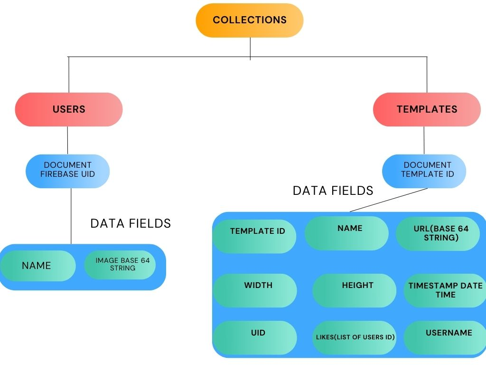

# MemeGen.JPG

MemeGen.JPG is an flutter application where user can add captions,image to meme template for generating meme.

# Features 

- Login/Signup
- Edit Profile
- Can use a template from a local file or the internet.
- Can also upload a template to the server from a file or the internet.
- Users can add like to meme templates or delete their own meme template.
- Can search meme templates from the list.
- Save meme in the gallery


# How to setup

- Fork and clone this repo.
- Create new firebase app and add files that are required for setup.
- For testing purpose you can still use my AdMob id.
- ```
  Flutter build apk --release //for release
  Flutter run -d <device_id>

  ```
  
# Lets Understand how Firestore Database Setup



# Demo


# Latest release

[https://github.com/Djsmk123/meme_maker/releases](https://github.com/Djsmk123/meme_maker/releases)


# Upcoming Features
[ ] Multiple meme template selector 

[ ] Videos/Gifs templates

[ ] Sticker for whatsapp

[ ] User profile enhancements

[ ]  ..... Many More


##### ***NOTE :*** You can request me on the Twitter @smk_winner to deleting your data.


